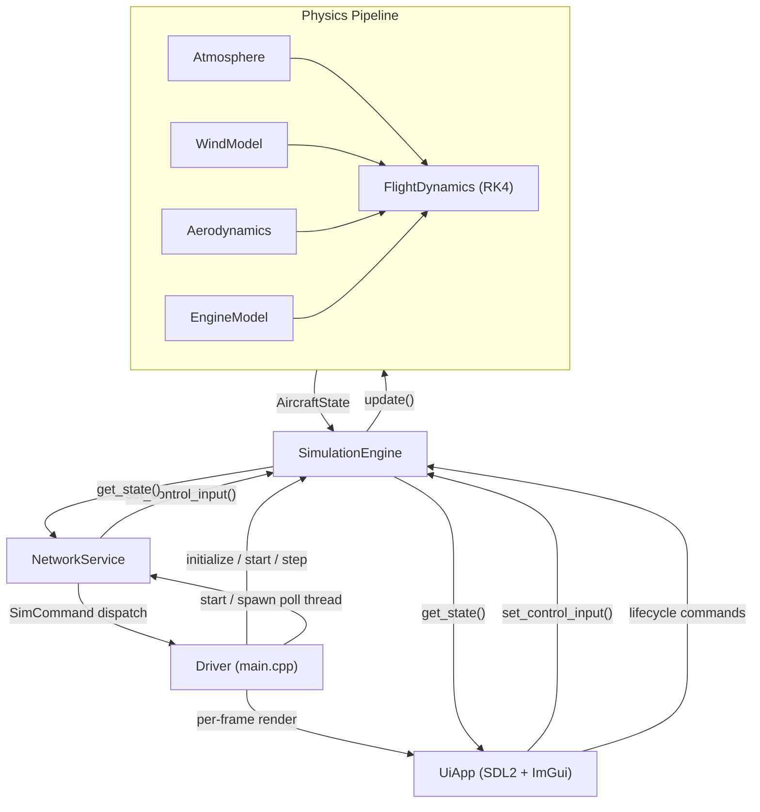
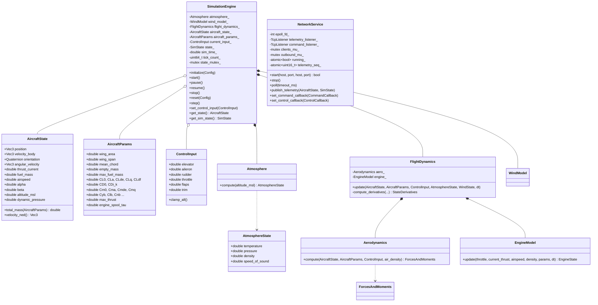
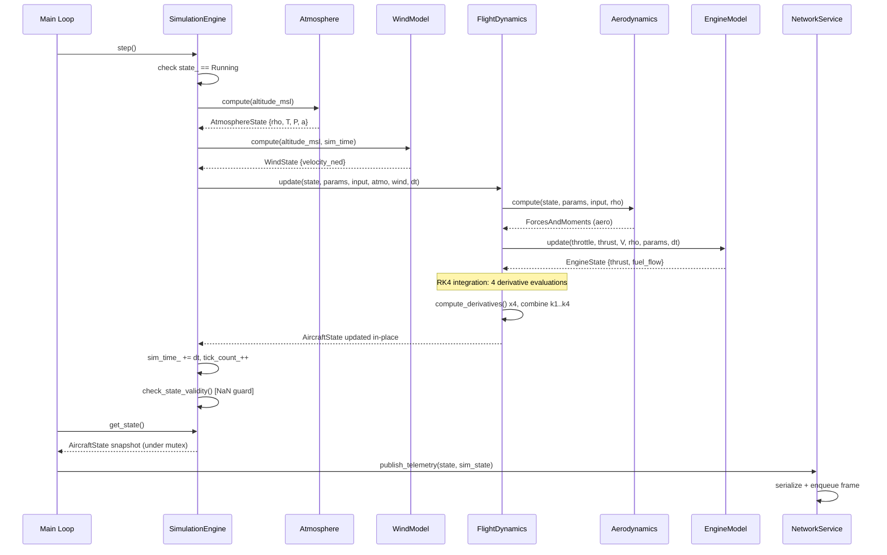
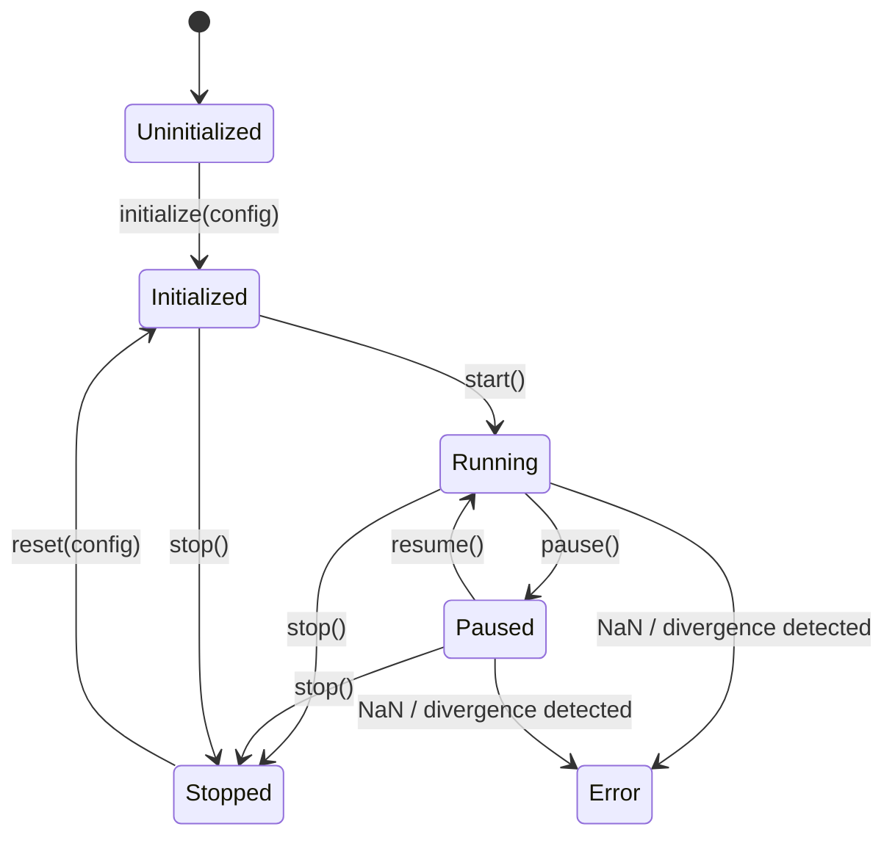
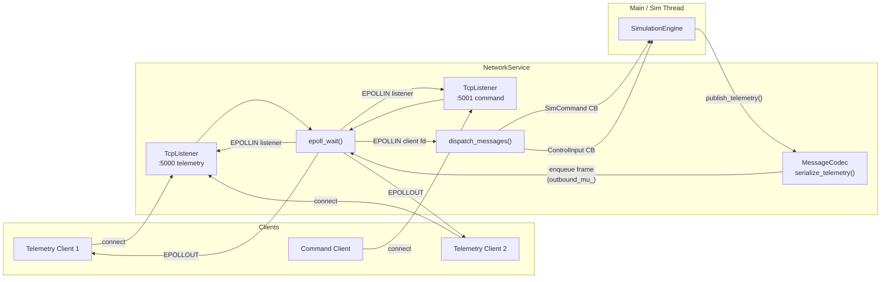

# luft -- Architecture

## 1. System Architecture



## 2. Component Overview

### Core Library (`src/core/`)

The simulation kernel. Zero dependency on SDL, OpenGL, or any UI toolkit. Compiles into a static library (`luft_core`) that can be linked by both the windowed application and headless test harnesses.

| File | Responsibility |
|---|---|
| `simulation_engine.h/cpp` | Top-level coordinator. Owns the physics pipeline, lifecycle state machine, and thread-safe `AircraftState` snapshot. |
| `aircraft_state.h` | Value types: `AircraftState`, `AircraftParams`, `ControlInput`, `ForcesAndMoments`, `SimState` enum. |
| `math_types.h` | `Vec3`, `Quaternion`, physical constants (gravity, ISA atmosphere, unit conversions). |
| `atmosphere.h/cpp` | ISA atmosphere model. Pure function of altitude -- returns temperature, pressure, density, speed of sound. |
| `wind_model.h/cpp` | Constant + gust wind field in NED frame. |
| `aerodynamics.h/cpp` | Stability-derivative aero model. Computes body-frame forces and moments from state, params, control deflections, and air density. |
| `engine_model.h/cpp` | First-order lag thrust model with fuel consumption. |
| `flight_dynamics.h/cpp` | Equations of motion integrator (RK4). Owns private `Aerodynamics` and `EngineModel` instances. Computes `StateDerivatives` and integrates. |
| `config.h/cpp` | `Config` struct with all runtime knobs. Key=value `.cfg` loader and validator. |
| `logger.h/cpp` | Singleton logger with level filtering, file + console sinks. |
| `net/protocol.h` | Wire format: 8-byte packed `MessageHeader` (length, type, sequence) in network byte order. Message types: Telemetry, ControlInput, SimCommand, ConfigUpdate, Ack, Nack. Max message 64 KB. |
| `net/message_codec.h/cpp` | Streaming framing codec (`feed` bytes, `pop` complete `FramedMessage`). Serialization/deserialization for telemetry, control input, sim command payloads. |
| `net/socket.h/cpp` | RAII wrappers: `TcpSocket` (connected fd) and `TcpListener` (server socket). Non-blocking I/O. |
| `net/network_service.h/cpp` | Epoll-driven service with two TCP listeners (telemetry broadcast, command ingest). Up to 8 clients per listener. |

### UI Library (`src/ui/`)

Optional. Compiled only when `LUFT_HAS_UI` is defined. Links SDL2 and Dear ImGui.

| File | Responsibility |
|---|---|
| `ui_app.h/cpp` | SDL2/OpenGL window, ImGui integration. Renders telemetry gauges, control-input sliders, sim lifecycle buttons, connection status, and a scrolling log panel. Translates WASD/Shift/Ctrl keyboard state into `ControlInput`. |

### Driver (`src/app/main.cpp`)

Wires everything together:

- Parse CLI args (`--config`, `--headless`, `--help`).
- Load and validate `Config`.
- Initialize logger, `SimulationEngine`, `NetworkService`, and optionally `UiApp`.
- Run the main loop: step simulation to catch up with wall clock, publish telemetry at configurable rate, render UI frame.
- Graceful shutdown on SIGINT/SIGTERM via atomic flag.

## 3. Thread Model

```
Main thread                          Network thread
============                         ==============
parse args                           (created after NetworkService::start)
load config                          |
init logger                          v
init SimEngine                       loop {
init NetworkService  -----spawn-->     network_service->poll(10ms)
init UiApp                             // epoll_wait, accept, recv, send
                                       // dispatch commands via callbacks
loop {                               }
  sim_engine.step()  (x N)           |
  publish_telemetry()                (joins on shutdown)
  ui->process_events()
  ui->render*()
  sleep(1ms)
}
shutdown
```

**Main thread** -- Drives both the simulation loop and UI rendering. Calls `SimulationEngine::step()` in a catch-up loop (up to 20 steps per frame) to stay synchronized with wall-clock time. After stepping, publishes telemetry at a configurable rate (default 20 Hz) and renders one UI frame. A 1 ms sleep prevents CPU spin.

**Network thread** -- A dedicated `std::thread` running `NetworkService::poll()` in a loop with a 10 ms epoll timeout. Handles TCP accept, read, and write for both telemetry and command connections. Exits when `g_quit_flag` is set. Cross-thread interactions (command dispatch, control input, telemetry publish) go through the engine's mutex or the network service's own mutexes.

## 4. Class Diagram



## 5. Simulation Step Sequence



## 6. SimState State Machine



Transitions are enforced by `SimulationEngine::is_valid_transition()`. The `Error` state is effectively terminal within a session -- the driver detects it and exits the main loop.

| From | To | Trigger |
|---|---|---|
| Uninitialized | Initialized | `initialize(config)` |
| Stopped | Initialized | `reset(config)` |
| Initialized, Paused | Running | `start()` / `resume()` |
| Running | Paused | `pause()` |
| Running, Paused, Initialized | Stopped | `stop()` |
| Running, Paused | Error | Internal NaN/divergence check |

## 7. Network Flow



### Wire Protocol

- **Header**: 8 bytes, packed, network byte order -- `[length:u32 | type:u16 | sequence:u16]`.
- **Message types**: `Telemetry` (0x0001, server-to-client), `ControlInput` (0x0002, client-to-server), `SimCommand` (0x0003), `ConfigUpdate` (0x0004), `Ack` (0x0010), `Nack` (0x0011).
- **Framing**: Length-prefixed. `MessageCodec` accumulates partial reads in a recv buffer and emits complete `FramedMessage` objects.
- **Limits**: 8 clients per listener, 64 KB max message size.

### Data Flow Detail

1. **Telemetry publish** (main thread -> network thread): `publish_telemetry()` serializes state, locks `outbound_mu_`, writes the frame to `outbound_frame_`, sets `outbound_pending_`. The network thread's `poll()` drains it and flushes to all telemetry clients.
2. **Command ingest** (network thread -> main thread): `poll()` reads from command client fds, `MessageCodec` assembles complete messages, `dispatch_messages()` invokes the registered `CommandCallback` or `ControlCallback`. These callbacks call directly into `SimulationEngine` (mutex-protected).

## 8. UI / Backend Interaction

The UI layer (`UiApp`) has no direct pointer to `SimulationEngine`. All interaction is mediated by the driver in `main.cpp`:

- **State readout**: Each frame, the driver calls `sim_engine.get_state()` (mutex-protected snapshot) and passes the returned `AircraftState` to `ui->render_telemetry()`.
- **Control input**: The driver calls `ui->get_keyboard_control_input()` and `ui->render_controls()` to collect input, then forwards it to `sim_engine.set_control_input()`.
- **Lifecycle commands**: `ui->render_sim_controls()` returns button-click flags via out-parameters; the driver maps these to `sim_engine.start()` / `pause()` / `resume()` / `reset()` / `stop()`.
- **Log panel**: `UiApp` maintains an internal ring buffer (`log_buffer_`, 200 entries, 256 chars each). Entries are added via `add_log_entry()` (can be called from any thread) and rendered by `render_log_panel()`. The ring buffer has its own `log_mutex_`.
- **Conditional compilation**: The UI is gated behind `LUFT_HAS_UI`. When built without it, or when `--headless` is passed, the driver prints a one-line telemetry summary to stdout at the telemetry rate instead.

## 9. Thread Safety

### Mutex-protected Data

| Mutex | Location | Protects |
|---|---|---|
| `SimulationEngine::state_mutex_` | `simulation_engine.h:113` | `aircraft_state_` and `current_input_`. Locked by `get_state()`, `set_control_input()`, and within `step()` when reading input / writing state. |
| `NetworkService::clients_mu_` | `network_service.h:92` | `telemetry_clients_` and `command_clients_` vectors. Locked when the sim thread publishes telemetry (cross-thread) and when the network thread modifies client maps. |
| `NetworkService::outbound_mu_` | `network_service.h:97` | `outbound_frame_` buffer and `outbound_pending_` flag. Swap semantics: sim thread writes a single latest frame, network thread drains it. |
| `UiApp::log_mutex_` | `ui_app.h:101` | `log_buffer_` ring buffer. Allows log entries from any thread while the UI thread reads for rendering. |

### Atomic Variables

| Variable | Location | Purpose |
|---|---|---|
| `g_quit_flag` | `main.cpp:30` | `atomic<bool>`. Signal handler sets with `memory_order_release`; main loop and network thread read with `memory_order_acquire`. |
| `NetworkService::running_` | `network_service.h:106` | `atomic<bool>`. Gate for the poll loop. |
| `NetworkService::telemetry_seq_` | `network_service.h:101` | `atomic<uint16_t>`. Monotonically increasing sequence number stamped into telemetry headers so clients can detect drops. |

### Thread-access Matrix

| Data | Written by | Read by | Synchronization |
|---|---|---|---|
| `AircraftState` | Main (step) | Main (render), Network (publish) | `state_mutex_` |
| `ControlInput` | Network (command CB), Main (UI) | Main (step) | `state_mutex_` |
| `SimState` | Main (lifecycle) | Main, Network | Read via accessor; transitions happen on main thread only |
| Outbound telemetry frame | Main (publish) | Network (poll) | `outbound_mu_` |
| Client fd maps | Network (accept/remove) | Main (publish) | `clients_mu_` |

### Lock Ordering

To prevent deadlock, locks are acquired in this order:

1. `outbound_mu_` (telemetry frame swap -- very short hold)
2. `clients_mu_` (client list iteration)
3. `state_mutex_` (sim state read/write, via callbacks)

The main thread only ever holds one lock at a time. The network thread may hold `clients_mu_` while entering a callback that acquires `state_mutex_`, which is safe because `state_mutex_` is always last.

## 10. Design Decisions and Rationale

**Fixed time-step with wall-clock catch-up.** The simulation advances in fixed `dt` increments (default 0.01 s / 100 Hz) rather than variable-step. This makes the integrator deterministic and reproducible. The main loop runs up to 20 steps per frame to stay synchronized with real time, preventing spiral-of-death when rendering is slow.

**Quaternion orientation.** `Quaternion` is used instead of Euler angles for internal state to avoid gimbal lock at +/-90 degrees pitch. Euler angles are extracted only for display. The quaternion is re-normalized after every integration step to prevent numerical drift.

**Stability-derivative aerodynamics.** A linearized coefficient model (`CL_alpha`, `Cm_q`, etc.) is used instead of lookup tables or CFD. This keeps the model transparent and tunable from a config file, and is adequate for a Cessna-172-class aircraft at normal flight attitudes.

**RK4 integration.** Fourth-order Runge-Kutta provides a good balance of accuracy and simplicity for the flight dynamics ODE. The engine model uses a simpler first-order exponential lag (outside RK4) since thrust response is already modeled as a time constant.

**First-order thrust lag.** Engine thrust follows throttle through a first-order lag (`engine_spool_tau`), preventing instantaneous thrust changes and adding realism without complex turbine modeling.

**Separate telemetry and command ports.** Two TCP listeners (default :5000 and :5001) separate read-only observers from write-capable controllers. This allows monitoring tools to connect without risk of accidentally injecting commands, and simplifies access control.

**Epoll on a dedicated thread.** Network I/O is fully non-blocking and multiplexed via Linux `epoll`. Running it on its own thread keeps the simulation loop's timing clean. The 10 ms epoll timeout bounds shutdown latency.

**Single-frame telemetry buffer (swap semantics).** Only the latest telemetry frame is kept in `outbound_frame_`. If the network thread is slow, stale frames are silently overwritten. This prioritizes freshness over reliability -- appropriate for real-time telemetry where only the current state matters.

**UI as optional overlay.** The UI is conditionally compiled (`LUFT_HAS_UI`) and can be disabled at runtime (`--headless`). The core library has no UI dependency whatsoever. This enables server-side or embedded deployments and simplifies automated testing.

**Non-copyable, non-movable engine.** `SimulationEngine` deletes copy and move operations because it owns a `std::mutex`. This prevents accidental aliasing and makes ownership explicit.

**NaN divergence guard.** `check_state_validity()` runs after every integration step. If NaN or infinite values appear in the aircraft state, the engine transitions to `SimState::Error` and the driver exits the main loop. This prevents silent corruption from propagating.

**Config-driven design.** All tunable parameters (time step, network ports, aircraft coefficients, initial conditions, wind) live in `Config` and are loaded from a `.cfg` file. This avoids recompilation for parameter sweeps and makes the simulator easy to script.
