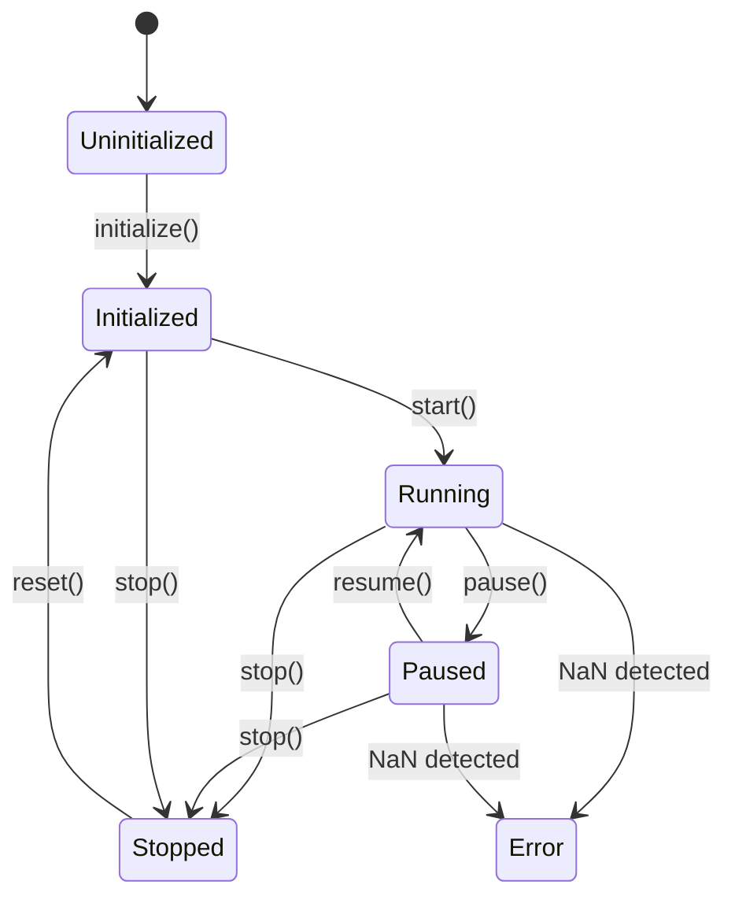

# Developer Guide

## Adding a New Aircraft Type

Aircraft behavior is defined entirely by `AircraftParams` in `src/core/aircraft_state.h`. To add a new aircraft:

1. Create a factory function or lookup table that returns an `AircraftParams` populated with the new type's coefficients:

```cpp
// src/core/aircraft_params_db.h  (or similar)
namespace luft {

inline AircraftParams make_boeing737_params()
{
    AircraftParams p;
    p.wing_area    = 124.6;     // m^2
    p.wing_span    = 28.88;     // m
    p.mean_chord   = 4.31;      // m
    p.empty_mass   = 41413.0;   // kg
    p.max_fuel_mass = 20000.0;  // kg
    p.Ixx          = 1_000_000; // kg*m^2  (example)
    // ... fill all stability derivatives ...
    p.max_thrust   = 120000.0;  // N (two engines)
    return p;
}

} // namespace luft
```

2. Wire the `config.aircraft_type` string to the factory. In `SimulationEngine::initialize()`, resolve the string to an `AircraftParams` and store it in `aircraft_params_`.

3. Adjust `initial_altitude_m`, `initial_airspeed_ms`, and `initial_fuel_kg` in the config defaults or `.cfg` file to suit the new type's flight envelope.

The coefficients that matter most are the stability derivatives (`CLa`, `Cma`, `Cnb`, etc.) and control power derivatives (`Cmde`, `Clda`, `Cndr`). These come from wind tunnel data, DATCOM estimates, or published reports for the aircraft type.

**Tip**: Start by copying `AircraftParams` defaults (Cessna 172) and changing one coefficient at a time. Run the sim and verify the aircraft still trims and responds correctly before changing the next.

## Adding a New Aerodynamic Effect

All aerodynamic force and moment computation lives in `Aerodynamics::compute()` (`src/core/aerodynamics.h`, `src/core/aerodynamics.cpp`).

The method signature:

```cpp
ForcesAndMoments compute(const AircraftState &state,
                         const AircraftParams &params,
                         const ControlInput &input,
                         double air_density) const;
```

To add a new effect (e.g. ground effect, compressibility correction, stall model):

1. Add any new parameters to `AircraftParams` (e.g. `double ground_effect_height`).
2. Add any new state variables to `AircraftState` if the effect needs persistent state.
3. Inside `compute()`, calculate the additional force/moment contribution and add it to the `ForcesAndMoments` accumulator:

```cpp
// Example: ground effect lift multiplier
double height_agl = -state.position.z; // NED z-down
if (height_agl < params.wing_span) {
    double ratio = height_agl / params.wing_span;
    double ge_factor = 1.0 + 0.5 * (1.0 - ratio); // simple model
    fm.force.z *= ge_factor; // increase lift near ground
}
```

4. Write tests in `tests/test_aerodynamics.cpp` verifying the effect activates under the right conditions and produces physically reasonable magnitudes.

Forces in `ForcesAndMoments` are in the **body frame** (x = forward, y = right, z = down). Moments follow right-hand-rule about body axes (x = roll, y = pitch, z = yaw).

## Adding a New Message Type

### 1. Define the type in `src/core/net/protocol.h`

Add an entry to the `MessageType` enum:

```cpp
enum class MessageType : uint16_t
{
    Telemetry    = 0x0001,
    ControlInput = 0x0002,
    SimCommand   = 0x0003,
    ConfigUpdate = 0x0004,
    Ack          = 0x0010,
    Nack         = 0x0011,
    WeatherUpdate = 0x0005,   // <-- new
};
```

### 2. Add serialization/deserialization to `MessageCodec`

In `src/core/net/message_codec.h`, add static methods:

```cpp
static std::vector<uint8_t> serialize_weather(const WeatherData &data);
static bool deserialize_weather(const uint8_t *data, size_t len, WeatherData &out);
```

Implement in `message_codec.cpp`. Use `std::memcpy` for POD types. Validate payload size before reading.

### 3. Add dispatch in `NetworkService`

In `NetworkService::dispatch_messages()` (`src/core/net/network_service.cpp`), add a `case` for the new type:

```cpp
case MessageType::WeatherUpdate:
{
    WeatherData data;
    if (MessageCodec::deserialize_weather(msg.payload.data(), msg.payload.size(), data)) {
        if (weather_cb_) weather_cb_(data);
    }
    break;
}
```

Add the corresponding callback type and setter to `NetworkService`:

```cpp
using WeatherCallback = std::function<void(const WeatherData &)>;
void set_weather_callback(WeatherCallback cb);
```

### 4. Write tests

Add tests to `tests/test_message_codec.cpp`:
- Serialization/deserialization roundtrip.
- Payload size validation (too small, too large).
- Edge cases for field values.

## Adding a New UI Panel

The UI is built with Dear ImGui and managed by `UiApp` (`src/ui/ui_app.h`).

1. Add a `render_*` method to `UiApp`:

```cpp
// ui_app.h
void render_weather_panel(const WeatherData &weather);
```

2. Implement it in `ui_app.cpp` using ImGui calls:

```cpp
void UiApp::render_weather_panel(const WeatherData &weather)
{
    ImGui::Begin("Weather");
    ImGui::Text("Wind N: %.1f m/s", weather.wind_north);
    ImGui::Text("Wind E: %.1f m/s", weather.wind_east);
    // ...
    ImGui::End();
}
```

3. Call the method from the main loop in `src/app/main.cpp`, inside the `#if LUFT_HAS_UI` block:

```cpp
ui->render_weather_panel(current_weather);
```

The render calls between `begin_frame()` and `end_frame()` can appear in any order. Each `ImGui::Begin()`/`End()` pair creates an independent dockable window.

Build with `-DLUFT_BUILD_UI=ON` to enable UI compilation.

## Writing Tests

Tests use Google Test and live in `tests/test_*.cpp`. The CMake build auto-discovers all files matching that pattern.

### File naming

```
tests/test_<module>.cpp
```

Existing test files:
- `test_math.cpp` -- Vec3, Quaternion operations
- `test_atmosphere.cpp` -- ISA atmosphere model
- `test_aerodynamics.cpp` -- force/moment computation
- `test_config.cpp` -- config loading/validation
- `test_message_codec.cpp` -- wire protocol framing
- `test_network.cpp` -- socket/network integration
- `test_input.cpp` -- control input handling

### Patterns

**Test fixture for shared setup**:

```cpp
class AerodynamicsTest : public ::testing::Test
{
protected:
    Aerodynamics aero;
    AircraftParams params;  // defaults to Cessna 172
    ControlInput input;

    AircraftState make_state(double airspeed, double alpha = 0.0) {
        AircraftState s;
        s.airspeed = airspeed;
        s.alpha = alpha;
        s.dynamic_pressure = 0.5 * kSeaLevelDensity * airspeed * airspeed;
        return s;
    }
};
```

**Standalone tests for stateless functions**:

```cpp
TEST(MessageCodec, EncodeDecodeRoundtrip)
{
    const uint8_t payload[] = {0x01, 0x02};
    auto wire = MessageCodec::encode(MessageType::SimCommand, 42, payload, 2);
    MessageCodec codec;
    codec.feed(wire.data(), wire.size());
    ASSERT_TRUE(codec.has_message());
    auto msg = codec.pop_message();
    EXPECT_EQ(msg.type, MessageType::SimCommand);
}
```

**What to test**:
- Zero/edge inputs (zero airspeed, empty payload, max values).
- Roundtrip consistency (serialize then deserialize, verify equality).
- Physical reasonableness (lift opposes weight at trim, drag opposes motion).
- Boundary validation (reject oversized messages, reject invalid enum values).
- Partial/incremental behavior (byte-by-byte feed into codec).

### Running tests

```bash
cd build
cmake .. -DLUFT_BUILD_TESTS=ON
cmake --build .
ctest --output-on-failure
# or run directly:
./luft_tests
```

## Code Conventions

| Convention | Details |
|---|---|
| Namespace | All code lives in `namespace luft` |
| Include guards | `#pragma once` (no `#ifndef` guards) |
| Parameter passing | `const T &` for read-only, `T &` for output, `T` for small PODs |
| Naming | `snake_case` for functions, variables, files; `PascalCase` for types; `kCamelCase` for constants |
| Member variables | Trailing underscore: `fd_`, `state_mutex_`, `recv_buf_` |
| Exceptions | **Not used**. Error handling via return values (`bool`, error strings) |
| Standard | C++20, enforced by CMake (`CMAKE_CXX_STANDARD 20`) |
| Warnings | `-Wall -Wextra -Wpedantic` enabled project-wide |

## Design Patterns

### RAII sockets

`TcpSocket` and `TcpListener` own their file descriptors. The destructor calls `close()`. Move semantics transfer ownership; copy is deleted. This eliminates fd leaks on any code path, including exceptions (even though we do not use them) and early returns.

```cpp
TcpSocket(TcpSocket &&other) noexcept;   // takes ownership
~TcpSocket();                              // close(fd_) if valid
```

### Singleton logger

`Logger::instance()` returns the single global logger. Thread-safe via `std::mutex`. Log macros (`LOG_INFO`, `LOG_DEBUG`, etc.) do an early-out level check before formatting to avoid `sprintf` overhead when the message would be discarded.

### Fixed-step simulation loop

The main loop advances the simulation in fixed `time_step` increments (default 0.01s / 100 Hz) to catch up with wall-clock time. This guarantees deterministic physics regardless of frame rate:

```cpp
while (sim_engine.get_sim_time() < elapsed && steps < kMaxStepsPerFrame) {
    sim_engine.step();
}
```

`kMaxStepsPerFrame = 20` caps catch-up to prevent spiral-of-death when the sim falls behind.

### State machine

`SimulationEngine` enforces a strict lifecycle:



Invalid transitions are rejected by `is_valid_transition()`. The `Error` state is entered automatically when `check_state_validity()` detects NaN or divergence.

## Performance Tips

### Profile with perf

```bash
# Build in Release with debug info
cmake .. -DCMAKE_BUILD_TYPE=RelWithDebInfo
cmake --build .

# Record 10 seconds of the sim running headless
perf record -g ./luft_sim --headless --config test.cfg &
sleep 10 && kill %1
perf report
```

Look for hotspots in `FlightDynamics::update()`, `Aerodynamics::compute()`, and `MessageCodec::serialize_telemetry()`.

### Watch allocations in step()

The simulation step should be allocation-free in steady state. `ForcesAndMoments` and `Vec3` are stack-allocated PODs. If you add new features, avoid `std::vector` resizing or `std::string` construction inside `step()`.

Profile allocations with:

```bash
valgrind --tool=massif ./luft_sim --headless
ms_print massif.out.<pid>
```

### Cache-friendly data layout

`AircraftState` is a contiguous struct of doubles -- one cache line covers most of the hot fields (position, velocity, orientation). Keep related fields adjacent. Avoid pointer chasing (e.g. `std::map` of subsystem states) in the inner loop.

## Debugging

### Log levels

Set in the `.cfg` file or at startup:

```
log_level = trace    # trace | debug | info | warn | error
log_console = true
log_file = luft.log
```

`trace` level logs every simulation step and every network message. Use sparingly -- it generates significant output.

### Headless mode

Run without the UI for faster iteration and easier stdout/logging inspection:

```bash
./luft_sim --headless --config my_test.cfg
```

Telemetry is printed to stdout at the configured telemetry rate. Network ports are still active for external clients.

### Breakpoints in step()

Set a conditional breakpoint in `SimulationEngine::step()` or `FlightDynamics::update()` to inspect state at a specific simulation time:

```
# GDB
break simulation_engine.cpp:step if sim_time_ > 5.0

# LLDB
breakpoint set -f simulation_engine.cpp -n step -c 'sim_time_ > 5.0'
```

Inspect `aircraft_state_` members: `position`, `velocity_body`, `orientation.to_euler()`, `alpha`, `beta`.

### Network debugging

Use `netcat` to verify the server is listening:

```bash
nc -z localhost 5000 && echo "telemetry port open"
nc -z localhost 5001 && echo "command port open"
```

Use `tcpdump` or Wireshark to inspect wire traffic:

```bash
tcpdump -i lo -X port 5000
```

## Common Pitfalls

### NED coordinate system: z is down

Position `z` is **negative** for altitudes above the origin. `altitude_msl` is derived as `-position.z`. Forgetting this sign convention is the most common source of "the aircraft tunnels into the ground" bugs.

```
NED Frame:
  x = North
  y = East
  z = Down (positive toward earth center)

altitude_msl = -position.z
```

### Quaternion renormalization

Numerical integration causes quaternion drift (norm deviates from 1.0). `FlightDynamics::update()` must renormalize after each integration step:

```cpp
state.orientation = state.orientation.normalized();
```

Skipping this causes the orientation to gradually scale, producing visually bizarre rotations and eventually NaN.

### Radians, not degrees

All angles in the simulation are in **radians**: `alpha`, `beta`, angular velocities, stability derivatives (per-radian). The only place degrees appear is in:
- Config file (`initial_heading_deg`), converted on load.
- `AircraftParams` max deflections, defined as `28.0 * kDegToRad` etc.
- UI display, converted via `kRadToDeg` for human readability.

If your new code produces forces that are 57x too large, you probably passed degrees where radians were expected.

### Body frame vs NED frame

- **Body frame**: x = forward (out the nose), y = right (out the right wing), z = down (through the belly). Used for: `velocity_body`, `angular_velocity`, `ForcesAndMoments`.
- **NED frame**: x = North, y = East, z = Down. Used for: `position`.

To convert between frames:

```cpp
Vec3 ned_velocity = state.orientation.rotate(state.velocity_body);       // body -> NED
Vec3 body_wind    = state.orientation.inverse_rotate(wind_ned);          // NED -> body
```

Mixing frames produces forces that point in wrong directions -- often subtle enough to look like a coefficient error.

### Control input sign conventions

| Input | -1 | +1 |
|---|---|---|
| `elevator` | nose down | nose up |
| `aileron` | left roll | right roll |
| `rudder` | left yaw | right yaw |
| `throttle` | 0 = idle | 1 = full |
| `flaps` | 0 = retracted | 1 = full |
| `trim` | nose down | nose up |

Note that `Cmde` is negative (-1.122), so positive elevator deflection produces a negative pitching moment -- which is nose-down in the body-frame sign convention. This is correct aerodynamic behavior (trailing-edge-up elevator creates nose-down moment relative to the AC, stabilized by the tail arm).

## Code Coverage

### Enable coverage

```bash
cd build
cmake .. -DLUFT_COVERAGE=ON -DLUFT_BUILD_TESTS=ON -DCMAKE_BUILD_TYPE=Debug
cmake --build .
```

This adds `--coverage -fprofile-arcs -ftest-coverage -O0 -g` to both compile and link flags.

### Run tests and generate report

```bash
# Run tests to generate .gcda files
./luft_tests

# Generate HTML report with lcov
lcov --capture --directory . --output-file coverage.info --ignore-errors mismatch
lcov --remove coverage.info '/usr/*' '*/build/_deps/*' --output-file coverage_filtered.info
genhtml coverage_filtered.info --output-directory coverage_html

# Open in browser
xdg-open coverage_html/index.html
```

### Reading the report

- **Line coverage**: percentage of source lines executed. Aim for >80% on core simulation code (`aerodynamics.cpp`, `flight_dynamics.cpp`, `simulation_engine.cpp`).
- **Branch coverage**: percentage of conditional branches taken both ways. Critical for state machine transitions and error handling paths.
- **Function coverage**: percentage of functions called at all. Should be 100% for public API methods.

Red lines in the HTML report are untested code paths. Prioritize covering:
1. Error/edge cases in `MessageCodec` (malformed messages, oversized payloads).
2. All `SimState` transitions including invalid ones.
3. Boundary conditions in aerodynamics (zero airspeed, extreme angles of attack).

### What to aim for

| Module | Target |
|---|---|
| `math_types.h` | >95% (pure functions, easy to test) |
| `aerodynamics.cpp` | >85% |
| `message_codec.cpp` | >90% |
| `simulation_engine.cpp` | >80% |
| `network_service.cpp` | >70% (harder to unit test; integration tests help) |
| `ui_app.cpp` | Not covered (requires GPU context) |
