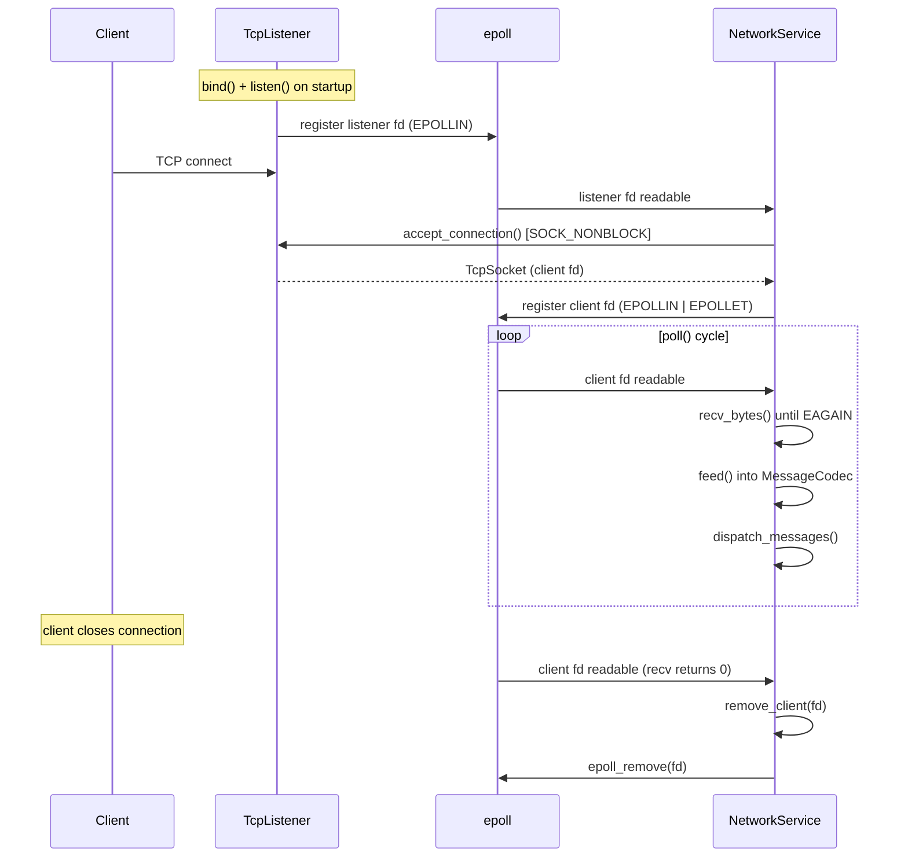
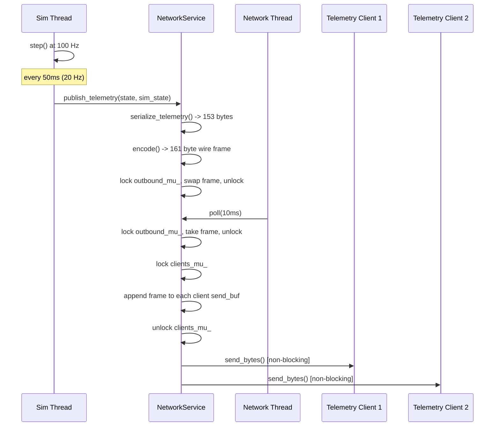

# Networking Design

## Architecture Overview

luft exposes two TCP server sockets, each on its own port:

| Port (default) | Direction | Purpose |
|---|---|---|
| `5000` | server -> client | Telemetry publish (aircraft state at configurable Hz) |
| `5001` | client -> server | Command receive (control inputs, sim commands) |

Separating telemetry from commands keeps the high-frequency outbound stream from head-of-line-blocking inbound control messages. A telemetry client (e.g. a glass cockpit display) never needs to send data; a command client (e.g. an autopilot) never needs to subscribe to telemetry. This also simplifies access control: you can expose the telemetry port to read-only consumers while restricting the command port.

Both ports are configurable in the `.cfg` file:

```
telemetry_host = 0.0.0.0
telemetry_port = 5000
command_host   = 0.0.0.0
command_port   = 5001
```

Up to `kMaxClients = 8` simultaneous connections are accepted per listener.

## Wire Protocol

Every message on the wire starts with an 8-byte `MessageHeader`, followed by a variable-length payload.

```
 0                   1                   2                   3
 0 1 2 3 4 5 6 7 8 9 0 1 2 3 4 5 6 7 8 9 0 1 2 3 4 5 6 7 8 9 0 1
+-+-+-+-+-+-+-+-+-+-+-+-+-+-+-+-+-+-+-+-+-+-+-+-+-+-+-+-+-+-+-+-+
|                     length (4 bytes)                          |
+-+-+-+-+-+-+-+-+-+-+-+-+-+-+-+-+-+-+-+-+-+-+-+-+-+-+-+-+-+-+-+-+
|         type (2 bytes)        |       sequence (2 bytes)      |
+-+-+-+-+-+-+-+-+-+-+-+-+-+-+-+-+-+-+-+-+-+-+-+-+-+-+-+-+-+-+-+-+
|                       payload (variable)                      |
+-+-+-+-+-+-+-+-+-+-+-+-+-+-+-+-+-+-+-+-+-+-+-+-+-+-+-+-+-+-+-+-+
```

| Field | Size | Byte Order | Description |
|---|---|---|---|
| `length` | 4 bytes (`uint32_t`) | Network (big-endian) | Total message size **including** the 8-byte header |
| `type` | 2 bytes (`uint16_t`) | Network (big-endian) | `MessageType` enum value |
| `sequence` | 2 bytes (`uint16_t`) | Network (big-endian) | Monotonically increasing per-stream sequence number |

The header is declared as a packed struct with a `static_assert` guaranteeing exactly 8 bytes. Serialization uses `htonl`/`htons` (pack) and `ntohl`/`ntohs` (unpack) for portable byte ordering.

Maximum message size is `kMaxMessageSize = 65536` bytes. The codec discards the receive buffer if a header advertises a length exceeding this limit.

## Message Types

### Telemetry (`0x0001`) -- server -> client

Payload: 18 `double` values (little-endian, native IEEE 754) followed by 1 `uint8_t` sim state byte. Total payload: `18 * 8 + 1 = 145` bytes.

| Offset | Type | Field |
|---|---|---|
| 0 | `double` | `position.x` (NED north, meters) |
| 8 | `double` | `position.y` (NED east, meters) |
| 16 | `double` | `position.z` (NED down, meters -- negative = above ground) |
| 24 | `double` | `velocity_body.x` (forward, m/s) |
| 32 | `double` | `velocity_body.y` (right, m/s) |
| 40 | `double` | `velocity_body.z` (down, m/s) |
| 48 | `double` | `orientation.w` (quaternion scalar) |
| 56 | `double` | `orientation.x` |
| 64 | `double` | `orientation.y` |
| 72 | `double` | `orientation.z` |
| 80 | `double` | `angular_velocity.x` (roll rate, rad/s) |
| 88 | `double` | `angular_velocity.y` (pitch rate, rad/s) |
| 96 | `double` | `angular_velocity.z` (yaw rate, rad/s) |
| 104 | `double` | `airspeed` (m/s) |
| 112 | `double` | `alpha` (angle of attack, rad) |
| 120 | `double` | `beta` (sideslip angle, rad) |
| 128 | `double` | `altitude_msl` (meters) |
| 136 | `double` | `thrust_current` (Newtons) |
| 144 | `double` | `fuel_mass` (kg) |
| 152 | `uint8_t` | `SimState` enum (0=Uninitialized, 1=Initialized, 2=Running, 3=Paused, 4=Stopped, 5=Error) |

Total wire size with header: `8 + 153 = 161` bytes.

### ControlInput (`0x0002`) -- client -> server

Payload: 6 `double` values. Total payload: 48 bytes.

| Offset | Type | Range | Field |
|---|---|---|---|
| 0 | `double` | [-1, 1] | `elevator` (nose-down to nose-up) |
| 8 | `double` | [-1, 1] | `aileron` (left roll to right roll) |
| 16 | `double` | [-1, 1] | `rudder` (left yaw to right yaw) |
| 24 | `double` | [0, 1] | `throttle` |
| 32 | `double` | [0, 1] | `flaps` |
| 40 | `double` | [-1, 1] | `trim` (elevator trim) |

The codec validates the payload size (must be exactly `6 * sizeof(double)`) and returns `false` on mismatch.

### SimCommand (`0x0003`) -- client -> server

Payload: 1 `uint8_t` encoding a `SimCommandType`.

| Value | Command |
|---|---|
| 1 | Start |
| 2 | Pause |
| 3 | Resume |
| 4 | Reset |
| 5 | Stop |

The codec rejects values outside [1, 5].

### Ack (`0x0010`) / Nack (`0x0011`) -- server -> client

Variable-length payload, application-defined. Used for acknowledging or rejecting commands.

### ConfigUpdate (`0x0004`) -- client -> server

Reserved for runtime configuration changes. Payload format is application-defined.

## Non-Blocking I/O with epoll

`NetworkService` uses Linux `epoll` for I/O multiplexing. This is chosen over `select`/`poll` because:

- **O(1) readiness notification** -- epoll does not re-scan every fd on each call.
- **Scales to many connections** without degradation.
- **Edge-triggered mode** (`EPOLLET`) minimizes spurious wakeups: the kernel only notifies on *new* readiness transitions, not repeatedly while a socket is readable.

### Socket setup

1. `TcpListener::bind_and_listen()` creates a server socket with `SO_REUSEADDR`.
2. `accept_connection()` uses `accept4(fd, ..., SOCK_NONBLOCK)` to produce already-non-blocking client sockets in a single syscall (avoids a separate `fcntl` call).
3. Every accepted socket also gets `TCP_NODELAY` to disable Nagle's algorithm -- critical for low-latency telemetry.
4. Both the listener fd and every client fd are registered with epoll using `EPOLLIN | EPOLLET` (edge-triggered).
5. When a client has pending outbound data, its epoll registration is modified to `EPOLLIN | EPOLLOUT | EPOLLET`.

### Why edge-triggered

With edge-triggered events, the network thread must drain the socket completely on each readable notification (read in a loop until `EAGAIN`). This avoids stale notifications and reduces the number of `epoll_wait` returns, which matters when publishing telemetry to multiple clients at 20+ Hz.

## Partial Read/Write Handling

TCP is a byte stream; a single `recv()` can return any number of bytes from 1 to the full message. `MessageCodec` handles this with an accumulation buffer (`recv_buf_`).

### Receive path

```
feed(data, len)
  |
  v
append to recv_buf_
  |
  v
try_parse():
  while recv_buf_ has >= kHeaderSize bytes:
    unpack_header -> get length
    if length > kMaxMessageSize:
      discard recv_buf_, return    // protocol violation
    if recv_buf_ has >= length bytes:
      extract payload, push to messages_ queue
      erase consumed bytes from recv_buf_
    else:
      break                        // wait for more data
```

### Send path

Each `ClientInfo` maintains a `send_buf` and `send_offset`. `flush_send_queue()` calls `send_bytes()` in a loop until `EAGAIN`, advancing the offset. When the buffer is fully drained, the epoll registration drops `EPOLLOUT` to avoid busy-spinning.

## Connection Lifecycle



### Disconnect cleanup

When `recv_bytes()` returns 0 (peer closed) or -1 (hard error), `remove_client()`:
1. Removes the fd from epoll.
2. Erases the `ClientInfo` from the appropriate client vector (`telemetry_clients_` or `command_clients_`).
3. The `TcpSocket` destructor closes the fd (RAII).

## Thread Model

luft uses two threads for networking:

```
 Main Thread (sim thread)                Network Thread
 ========================                ==============
 while running:                          while running:
   sim_engine.step()                       network_service.poll(10ms)
   if telemetry_due:                         epoll_wait()
     network_service.publish_telemetry()     accept new clients
                                             read inbound data
                                             dispatch commands -> callbacks
                                             flush outbound send buffers
```

- The **main thread** owns the simulation loop. At the configured telemetry rate (default 20 Hz), it calls `publish_telemetry()`, which serializes the aircraft state and enqueues it for the network thread.
- The **network thread** runs `poll()` in a tight loop with a 10ms epoll timeout. It handles all socket I/O: accepting connections, reading commands, writing telemetry frames.

The network thread is launched in `main.cpp` and joined during shutdown:

```cpp
network_thread = std::thread([&network_service]() {
    while (!g_quit_flag.load(std::memory_order_acquire)) {
        network_service->poll(10);
    }
});
```

## Thread Safety

Cross-thread data flows through two mutex-protected paths:

### 1. Telemetry publish (sim thread -> network thread)

`publish_telemetry()` serializes the state into a single wire frame, then swaps it into the `outbound_frame_` buffer under `outbound_mu_`:

```
sim thread:                           network thread (poll):
  serialize frame                       lock outbound_mu_
  lock outbound_mu_                     if outbound_pending_:
  swap into outbound_frame_               copy frame to each client send_buf
  set outbound_pending_ = true            set outbound_pending_ = false
  unlock                                unlock
                                        flush_send_queue() per client
```

This is a **frame swap** pattern: the sim thread never blocks on slow network I/O. If the network thread has not drained the previous frame, the new frame overwrites it. This is deliberate -- telemetry is best-effort; delivering the freshest state is more important than delivering every frame.

### 2. Client map access

`clients_mu_` protects `telemetry_clients_` and `command_clients_` vectors. The poll thread holds this lock briefly when adding/removing clients. `publish_telemetry()` also acquires it to iterate telemetry clients.

### 3. Sim engine thread safety

`SimulationEngine` protects `aircraft_state_` and `current_input_` with `state_mutex_`. The network command callback calls `set_control_input()` from the network thread, which safely publishes the input to the sim thread.

## Telemetry Flow



## Reconnection Strategy

The server is **stateless** with respect to client identity. When a client disconnects (graceful close or network failure), the server cleans up the `ClientInfo` entry. When the same or a new client connects, it gets a fresh `ClientInfo` and immediately starts receiving telemetry or can send commands.

There is no handshake, authentication, or session resumption. This keeps the protocol simple and well-suited for development/testing scenarios where clients may restart frequently.

A client that reconnects will observe a gap in sequence numbers. The sequence counter (`telemetry_seq_`) is atomic and never resets during a server run.

## Performance Considerations

### No allocations in the hot path

The telemetry publish path avoids heap allocations during the frame swap. `outbound_frame_` is a pre-allocated `std::vector<uint8_t>` that gets overwritten (not reallocated) on each publish. After the first few frames, its capacity stabilizes at 161 bytes and no further allocations occur.

### epoll efficiency

`epoll_wait` with a short timeout (10ms) means the network thread wakes at most 100 times/second when idle. Under load (clients connected, telemetry flowing), edge-triggered events minimize kernel-to-userspace transitions.

### TCP_NODELAY

Disabling Nagle's algorithm ensures that small telemetry frames (161 bytes) are sent immediately rather than being buffered for up to 200ms waiting for more data.

### Zero-copy where possible

`MessageCodec::encode()` writes the header and payload into a single contiguous buffer, which goes directly into the client's `send_buf`. There is no intermediate formatting step.

### Sequence numbers

The `telemetry_seq_` counter is `std::atomic<uint16_t>`, incremented with relaxed memory ordering. No mutex contention on the fast path.

## Example: Python Telemetry Client

```python
import socket
import struct

HEADER_FMT = '!IHH'       # network byte order: uint32 + uint16 + uint16
HEADER_SIZE = 8
TELEM_FMT = '<18dB'        # little-endian: 18 doubles + 1 uint8
TELEM_SIZE = struct.calcsize(TELEM_FMT)

FIELD_NAMES = [
    'pos_n', 'pos_e', 'pos_d',
    'vel_x', 'vel_y', 'vel_z',
    'qw', 'qx', 'qy', 'qz',
    'p', 'q', 'r',
    'airspeed', 'alpha', 'beta',
    'altitude', 'thrust', 'fuel',
    'sim_state',
]

def recv_exact(sock, n):
    """Read exactly n bytes from sock, handling partial reads."""
    buf = b''
    while len(buf) < n:
        chunk = sock.recv(n - len(buf))
        if not chunk:
            raise ConnectionError("peer closed")
        buf += chunk
    return buf

def connect_telemetry(host='127.0.0.1', port=5000):
    sock = socket.socket(socket.AF_INET, socket.SOCK_STREAM)
    sock.connect((host, port))
    print(f"Connected to {host}:{port}")

    try:
        while True:
            # 1. Read the 8-byte header
            hdr_bytes = recv_exact(sock, HEADER_SIZE)
            length, msg_type, seq = struct.unpack(HEADER_FMT, hdr_bytes)

            # 2. Read the remaining payload
            payload_len = length - HEADER_SIZE
            payload = recv_exact(sock, payload_len)

            # 3. Decode telemetry (type 0x0001)
            if msg_type == 0x0001 and len(payload) == TELEM_SIZE:
                values = struct.unpack(TELEM_FMT, payload)
                data = dict(zip(FIELD_NAMES, values))
                print(f"[seq={seq}] alt={data['altitude']:.0f}m "
                      f"V={data['airspeed']:.1f}m/s "
                      f"fuel={data['fuel']:.1f}kg "
                      f"state={data['sim_state']}")
    except KeyboardInterrupt:
        pass
    finally:
        sock.close()

if __name__ == '__main__':
    connect_telemetry()
```

Key points:
- The header uses network byte order (`!` prefix in struct format), matching `htonl`/`htons`.
- The payload uses **native little-endian** (`<` prefix) because the doubles are `memcpy`-serialized on an x86 host. If you run the server on a big-endian host, change to `>`.
- `recv_exact()` loops to handle partial TCP reads -- the same problem `MessageCodec::feed()` solves on the C++ side.

## Why Event-Driven Networking for Real-Time Systems

A flight simulator has a hard real-time constraint: the physics loop must advance at a fixed rate (100 Hz in luft). Networking must never block or stall that loop.

**Thread-per-connection** models are problematic because:
- Thread creation/destruction for each client adds latency jitter.
- Synchronization between many client threads and the sim thread becomes complex.
- Blocked writes on a slow client can cascade into thread pool exhaustion.

**Synchronous I/O in the sim loop** is worse: a single slow `send()` or `recv()` stalls the entire simulation.

The **event-driven** approach (single network thread + epoll) solves this:
- The sim thread is never blocked by network I/O. `publish_telemetry()` just copies bytes under a mutex.
- The network thread handles all clients in one loop. A slow client only backs up its own `send_buf`; other clients and the sim continue unaffected.
- `epoll_wait` with a short timeout gives the thread natural yield points without spinning.
- The total thread count is constant (main + network) regardless of client count.

This architecture ensures that network client behavior -- connects, disconnects, slow readers, burst senders -- cannot disturb the simulation's fixed-step timing.
