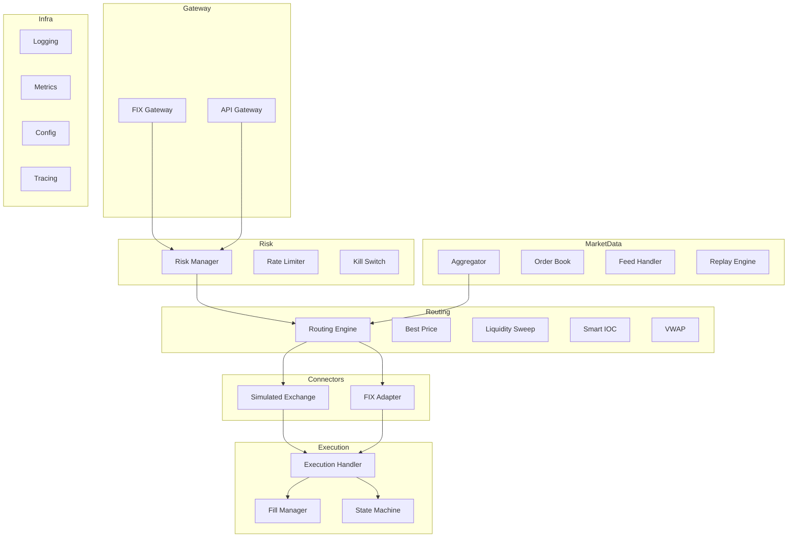

# System Architecture Diagram

```
┌─────────────────────────────────────────────────────────────────────┐
│                        SMART ORDER ROUTER                          │
├─────────────────────────────────────────────────────────────────────┤
│                                                                     │
│  ┌──────────┐   ┌──────────┐                                       │
│  │FIX Client│   │API Client│                                       │
│  └────┬─────┘   └────┬─────┘                                       │
│       │              │                                              │
│       ▼              ▼                                              │
│  ┌──────────────────────────┐                                       │
│  │       GATEWAY LAYER      │  (FIX Parser / JSON-ZMQ)              │
│  └────────────┬─────────────┘                                       │
│               │ Order                                               │
│               ▼                                                     │
│  ┌──────────────────────────┐                                       │
│  │     RISK MANAGER         │  Position limits, notional, rate      │
│  │  ┌─────────┐ ┌────────┐  │  limiter, kill switch                 │
│  │  │Rate Lim │ │Kill Sw │  │                                       │
│  │  └─────────┘ └────────┘  │                                       │
│  └────────────┬─────────────┘                                       │
│               │ Approved Order                                      │
│               ▼                                                     │
│  ┌──────────────────────────┐   ┌──────────────────────────┐        │
│  │    ROUTING ENGINE        │◄──│    MARKET DATA            │        │
│  │                          │   │    AGGREGATOR             │        │
│  │  ┌──────────────────┐    │   │  ┌────────┐ ┌────────┐   │        │
│  │  │ Best Price       │    │   │  │ NBBO   │ │L2 Book │   │        │
│  │  │ Liquidity Sweep  │    │   │  └────────┘ └────────┘   │        │
│  │  │ Smart IOC        │    │   │  ┌────────────────────┐   │        │
│  │  │ VWAP             │    │   │  │ Feed Handler       │   │        │
│  │  └──────────────────┘    │   │  │ Replay Engine      │   │        │
│  └──┬──────┬──────┬─────────┘   └──────────────────────────┘        │
│     │      │      │ Child Orders                                    │
│     ▼      ▼      ▼                                                 │
│  ┌──────┐┌──────┐┌──────┐                                           │
│  │Venue ││Venue ││Venue │  (SPSC queues to each adapter)            │
│  │Adpt 1││Adpt 2││Adpt N│                                           │
│  └──┬───┘└──┬───┘└──┬───┘                                           │
│     │      │      │                                                 │
├─────┼──────┼──────┼─────────────────────────────────────────────────┤
│     ▼      ▼      ▼       EXECUTION REPORTS (MPSC)                  │
│  ┌──────────────────────────┐                                       │
│  │   EXECUTION HANDLER      │  State machine, fill aggregation      │
│  │  ┌──────────┐ ┌────────┐ │                                       │
│  │  │State Mach│ │Fill Mgr│ │                                       │
│  │  └──────────┘ └────────┘ │                                       │
│  └──────────────────────────┘                                       │
│                                                                     │
│  ┌──────────────────────────────────────────────────────────┐       │
│  │ INFRASTRUCTURE: Logging (spdlog) │ Metrics (Prometheus)  │       │
│  │ Config (YAML) │ Tracing (per-order context)              │       │
│  └──────────────────────────────────────────────────────────┘       │
└─────────────────────────────────────────────────────────────────────┘
```

# Component Diagram (Mermaid)


