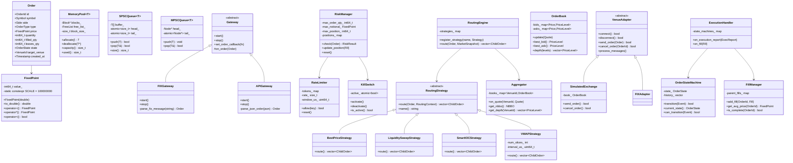

# Class Diagram

```mermaid
classDiagram
    class FixedPoint {
        -int64_t value_
        -static constexpr SCALE = 100000000
        +FixedPoint(double)
        +to_double() double
        +operator+() FixedPoint
        +operator*() FixedPoint
        +operator<() bool
    }

    class Order {
        +OrderId id
        +Symbol symbol
        +Side side
        +OrderType type
        +FixedPoint price
        +int64_t quantity
        +int64_t filled_qty
        +int64_t leaves_qty
        +OrderState state
        +VenueId target_venue
        +Timestamp created_at
    }

    class MemoryPool~T~ {
        -Block* blocks_
        -FreeList free_list_
        -size_t block_size_
        +allocate() T*
        +deallocate(T*)
        +capacity() size_t
        +used() size_t
    }

    class SPSCQueue~T~ {
        -T[] buffer_
        -atomic~size_t~ head_
        -atomic~size_t~ tail_
        +push(T) bool
        +pop(T&) bool
        +size() size_t
    }

    class MPSCQueue~T~ {
        -Node* head_
        -atomic~Node*~ tail_
        +push(T) void
        +pop(T&) bool
    }

    class Gateway {
        <<abstract>>
        +start()
        +stop()
        +set_order_callback(fn)
        #on_order(Order)
    }

    class FIXGateway {
        +start()
        +stop()
        -parse_fix_message(string) Order
    }

    class APIGateway {
        +start()
        +stop()
        -parse_json_order(json) Order
    }

    class RiskManager {
        -max_order_qty_ int64_t
        -max_notional_ FixedPoint
        -max_position_ int64_t
        -positions_ map
        +check(Order) RiskResult
        +update_position(Fill)
        +reset()
    }

    class RateLimiter {
        -tokens_ map
        -rate_ size_t
        -window_us_ uint64_t
        +allow(key) bool
        +reset()
    }

    class KillSwitch {
        -active_ atomic~bool~
        +activate()
        +deactivate()
        +is_active() bool
    }

    class RoutingStrategy {
        <<abstract>>
        +route(Order, RoutingContext) vector~ChildOrder~
        +name() string
    }

    class BestPriceStrategy {
        +route() vector~ChildOrder~
    }

    class LiquiditySweepStrategy {
        +route() vector~ChildOrder~
    }

    class SmartIOCStrategy {
        +route() vector~ChildOrder~
    }

    class VWAPStrategy {
        -num_slices_ int
        -interval_us_ uint64_t
        +route() vector~ChildOrder~
    }

    class RoutingEngine {
        -strategies_ map
        +register_strategy(name, Strategy)
        +route(Order, MarketSnapshot) vector~ChildOrder~
    }

    class OrderBook {
        -bids_ map~Price,PriceLevel~
        -asks_ map~Price,PriceLevel~
        +update(Quote)
        +best_bid() PriceLevel
        +best_ask() PriceLevel
        +depth(levels) vector~PriceLevel~
    }

    class Aggregator {
        -books_ map~VenueId,OrderBook~
        +on_quote(VenueId, Quote)
        +get_nbbo() NBBO
        +get_depth(VenueId) vector~PriceLevel~
    }

    class VenueAdapter {
        <<abstract>>
        +connect() bool
        +disconnect() bool
        +send_order(Order) bool
        +cancel_order(OrderId) bool
        +process_messages()
    }

    class SimulatedExchange {
        -book_ OrderBook
        +send_order() bool
        +cancel_order() bool
    }

    class OrderStateMachine {
        -state_ OrderState
        -history_ vector
        +transition(Event) bool
        +current_state() OrderState
        +can_transition(Event) bool
    }

    class ExecutionHandler {
        -state_machines_ map
        +on_execution_report(ExecReport)
        +on_fill(Fill)
    }

    class FillManager {
        -parent_fills_ map
        +add_fill(OrderId, Fill)
        +get_avg_price(OrderId) FixedPoint
        +is_complete(OrderId) bool
    }

    Gateway <|-- FIXGateway
    Gateway <|-- APIGateway
    RoutingStrategy <|-- BestPriceStrategy
    RoutingStrategy <|-- LiquiditySweepStrategy
    RoutingStrategy <|-- SmartIOCStrategy
    RoutingStrategy <|-- VWAPStrategy
    VenueAdapter <|-- SimulatedExchange
    VenueAdapter <|-- FIXAdapter

    RoutingEngine --> RoutingStrategy
    RoutingEngine --> Aggregator
    ExecutionHandler --> OrderStateMachine
    ExecutionHandler --> FillManager
    RiskManager --> RateLimiter
    RiskManager --> KillSwitch
    Order --> FixedPoint
```
