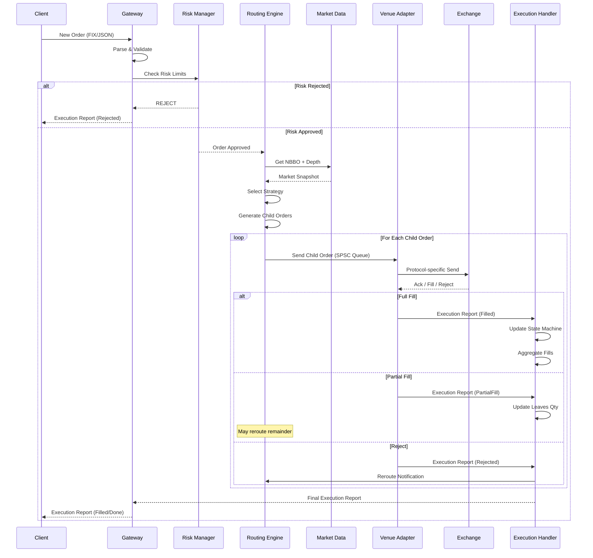
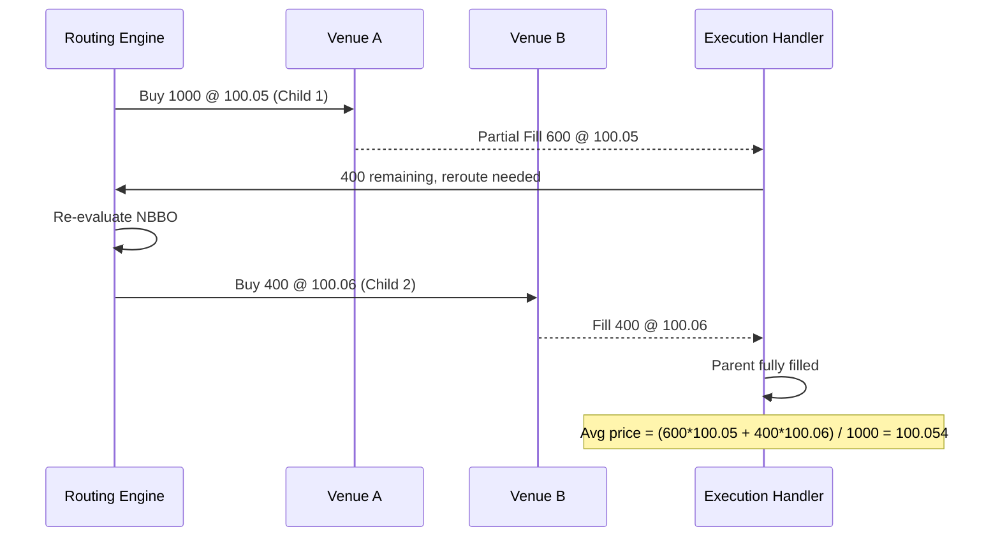

# Order Lifecycle Sequence Diagram

```mermaid
sequenceDiagram
    participant C as Client
    participant GW as Gateway
    participant RM as Risk Manager
    participant RE as Routing Engine
    participant MD as Market Data
    participant VA as Venue Adapter
    participant EX as Exchange
    participant EH as Execution Handler

    C->>GW: New Order (FIX/JSON)
    GW->>GW: Parse & Validate
    GW->>RM: Check Risk Limits

    alt Risk Rejected
        RM-->>GW: REJECT
        GW-->>C: Execution Report (Rejected)
    else Risk Approved
        RM-->>RE: Order Approved
        RE->>MD: Get NBBO + Depth
        MD-->>RE: Market Snapshot
        RE->>RE: Select Strategy
        RE->>RE: Generate Child Orders

        loop For Each Child Order
            RE->>VA: Send Child Order (SPSC Queue)
            VA->>EX: Protocol-specific Send
            EX-->>VA: Ack / Fill / Reject

            alt Full Fill
                VA->>EH: Execution Report (Filled)
                EH->>EH: Update State Machine
                EH->>EH: Aggregate Fills
            else Partial Fill
                VA->>EH: Execution Report (PartialFill)
                EH->>EH: Update Leaves Qty
                Note over RE: May reroute remainder
            else Reject
                VA->>EH: Execution Report (Rejected)
                EH->>RE: Reroute Notification
            end
        end

        EH-->>GW: Final Execution Report
        GW-->>C: Execution Report (Filled/Done)
    end
```

# Partial Fill + Reroute Sequence

```mermaid
sequenceDiagram
    participant RE as Routing Engine
    participant V1 as Venue A
    participant V2 as Venue B
    participant EH as Execution Handler

    RE->>V1: Buy 1000 @ 100.05 (Child 1)
    V1-->>EH: Partial Fill 600 @ 100.05
    EH->>RE: 400 remaining, reroute needed
    RE->>RE: Re-evaluate NBBO
    RE->>V2: Buy 400 @ 100.06 (Child 2)
    V2-->>EH: Fill 400 @ 100.06
    EH->>EH: Parent fully filled
    Note over EH: Avg price = (600*100.05 + 400*100.06) / 1000 = 100.054
```
