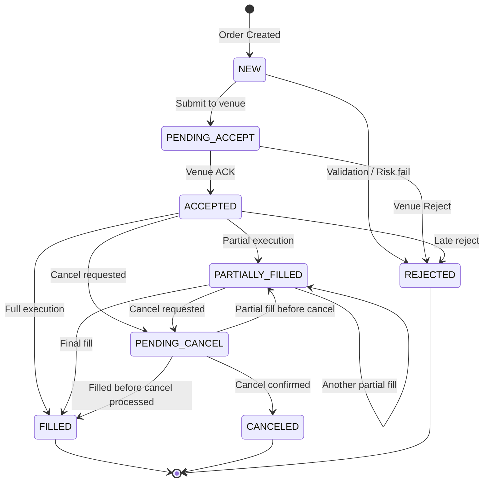

# Order State Machine Diagram



# State Transition Table

```
From State          | Event              | To State           | Notes
--------------------|--------------------|--------------------|------------------
NEW                 | submit             | PENDING_ACCEPT     |
NEW                 | reject             | REJECTED           | Risk/validation
PENDING_ACCEPT      | ack                | ACCEPTED           |
PENDING_ACCEPT      | reject             | REJECTED           | Venue reject
ACCEPTED            | partial_fill       | PARTIALLY_FILLED   |
ACCEPTED            | fill               | FILLED             |
ACCEPTED            | cancel_request     | PENDING_CANCEL     |
PARTIALLY_FILLED    | partial_fill       | PARTIALLY_FILLED   |
PARTIALLY_FILLED    | fill               | FILLED             |
PARTIALLY_FILLED    | cancel_request     | PENDING_CANCEL     |
PENDING_CANCEL      | cancel_ack         | CANCELED           |
PENDING_CANCEL      | fill               | FILLED             | Race condition
PENDING_CANCEL      | partial_fill       | PARTIALLY_FILLED   | Race condition
FILLED              | (terminal)         | -                  |
CANCELED            | (terminal)         | -                  |
REJECTED            | (terminal)         | -                  |
```

# ASCII State Machine

```
                    ┌─────────┐
                    │   NEW   │
                    └────┬────┘
              ┌──────────┼──────────┐
              ▼                     ▼
      ┌──────────────┐        ┌──────────┐
      │PENDING_ACCEPT│        │ REJECTED │◄─────────┐
      └──────┬───────┘        └──────────┘          │
        ┌────┼────┐                                 │
        ▼         ▼                                 │
  ┌──────────┐  (reject)────────────────────────────┘
  │ ACCEPTED │
  └────┬─────┘
  ┌────┼────────────┐
  ▼    ▼            ▼
┌────┐┌────────────┐┌──────────────┐
│FILL││PARTIAL_FILL││PENDING_CANCEL│
│  ED││   ◄────►   ││             │
└────┘└─────┬──────┘└──────┬──────┘
            │              │
            ▼              ▼
         ┌──────┐    ┌──────────┐
         │FILLED│    │ CANCELED │
         └──────┘    └──────────┘
```
